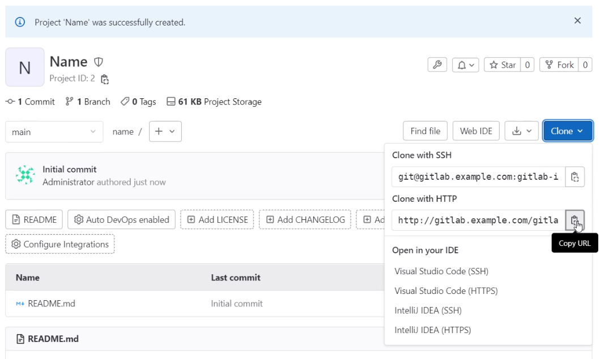

# final-project

### Elementos usados:
- 1 Maquina virtual
- Ubuntu Server 22.04
- Docker 20.10.21
- Docker Compose

<br><br>

Se clona el repositorio e ingresamos a la carpeta "final-project"

```bash
git clone https://github.com/MarlonTheOne/final-project.git
ls -l
cd final-project/
```


*Ejemplo de descarga de Docker Compose:* [Docker Compose](https://www.digitalocean.com/community/tutorials/how-to-install-and-use-docker-compose-on-ubuntu-22-04)<br><br>


Ingresamos a la carpeta donde se encuentran los archivos de configuración


Descargar las imagenes para los servicios WEB y el servidor de GitLab

```bash
docker pull httpd
docker pull gitlab/gitlab-ee
```


<br><br>
Dentro de la carpeta "docker-lb-web" ejecutar el docker compose
```bash
docker compose up --build
```


Revisamos que se haya creado el adaptador de red (Ese adaptador se va a adjuntar al contenedor de GitLab)
```bash
docker network ls
```


Se despliega el último contenedor del contenedor de GitLab.
```bash
sudo docker run --detach \
  --hostname gitlab.example.com \
  --publish 443:443 --publish 8080:80 --publish 21:22 \
  --network docker-lb-web_default \
  --name gitlab \
  --restart always \
  --volume $GITLAB_HOME/config:/etc/gitlab \
  --volume $GITLAB_HOME/logs:/var/log/gitlab \
  --volume $GITLAB_HOME/data:/var/opt/gitlab \
  --shm-size 256m \
  gitlab/gitlab-ee:latest
```


Validamos que todos los contenedores esten en el mismo segmento

```bash
docker inspect $(docker ps -q) | grep -i "ipaddress" | grep -vE "Name|Secondary"
```


Ingresamos dentro de los contenedores *Ingresar en ambos contenedores web y ejecutar los mismos comandos*
```bash
docker exec -it web2 bash
```


Actualizamos los repositorios dentro de los contenedores
```bash
apt update
```


Instalamos GIT y Nano
```bash
apt install git nano -y
```


Ingresamos dentro de la carpeta "htdocs" y editamos el archivo "index.html"
```bash
cd htdocs
ls
nano index.html
```


<br><br>

Link para ingresar a GitLab
```bash
http://IP:PORT/users/sign_in
```


El usuario en GitLab es "root" y la contraseña la obtenemos con el siguiente comando:
```bash
sudo docker exec -it gitlab grep 'Password:' /etc/gitlab/initial_root_password
```


Seleccionamos "New project"


Seleccionamos "Create blank project"


Agregamos un nombre y seleccionamos el nivel de visibilidad "Public"


Copiamos la dirección para clonar el repositorio


Creamos un archivo el cual subiremos como prueba el repositorio.


Inicializamos Git y publicamos a el repositorio que creamos en GitLab
```bash
git add .
git config --global user.email "you@example.com"
git config --global user.name "Your Name"
git commit -m "Primer commit"
git push
```


Validamos que el archivo se encuentre en el repositorio.
<br><br>


